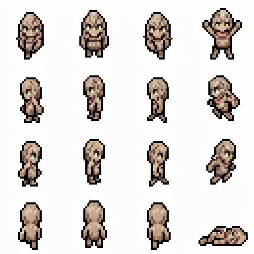
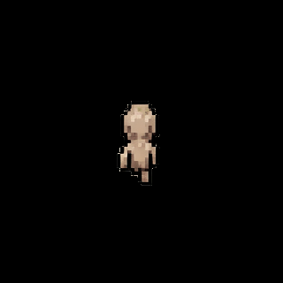

# preview-spritesheet

Command-line tool that generates an animated GIF from a pixel-art RPG spritesheet.

The character walks a few paces in each direction (up → left → right → down), pauses briefly between each, performs a pick-up action, then collapses into the dead / lie-down frame before the GIF loops.

## Spritesheet format

Expects a square image containing a **4×4 grid** of equal-sized frames — the same layout used by [pixel-art-spritesheet-sandbox](https://github.com/svntax/pixel-art-spritesheet-sandbox):

| Row | Frames | Content |
|-----|--------|---------|
| 0 | 0–3 | Walk down + pick-up action |
| 1 | 4–7 | Walk left + jump-left |
| 2 | 8–11 | Walk right + jump-right |
| 3 | 12–15 | Walk up + dead / lie-down |

Common input sizes are **128×128** (32×32 px per frame) and **512×512** (128×128 px per frame). Any square image whose width is divisible by 4 is accepted.

## Demo Test Case: YesRock

You can test the repository's grid extraction and animation loop validation using the provided `yesrock` assets.  This case demonstrates how the tool handles AI-generated pixel sheets with high-contrast textures.

| Source Sprite Sheet (`yesrock_sheet.png`) | Animated Loop Preview (`yesrock.gif`) |
| :---: | :---: |
|  |  |

## Setup

Requires [uv](https://docs.astral.sh/uv/).

```sh
cd preview-spritesheet
uv sync          # creates .venv/ and installs Pillow
```

## Usage

```
./make-gif [-h] [-o FILE] [-t N] [-c N] spritesheet
```

| Option | Default | Description |
|--------|---------|-------------|
| `spritesheet` | _(required)_ | Input spritesheet image |
| `-o FILE` / `--output FILE` | `<input>.gif` | Output GIF path |
| `-t N` / `--threshold N` | `30` | Background-removal colour tolerance (0–255) |
| `-c N` / `--cycles N` | `3` | Walk animation cycles per direction |

### Examples

```sh
# Basic — output written next to the input file
./make-gif /path/to/character.png

# Custom output path and looser background removal
./make-gif character_sheet.png -o preview.gif -t 50

# More steps per direction
./make-gif character_sheet.png -c 5
```

## Credits

- Spritesheet format and frame layout from
  [pixel-art-spritesheet-sandbox](https://github.com/svntax/pixel-art-spritesheet-sandbox)
  by **svntax** — MIT License, Copyright © 2026 svntax.
- Background-removal flood-fill approach adapted from the same project.
- [Pillow](https://python-pillow.org/) for image processing and GIF encoding.

## License

MIT License — see [LICENSE](LICENSE).
